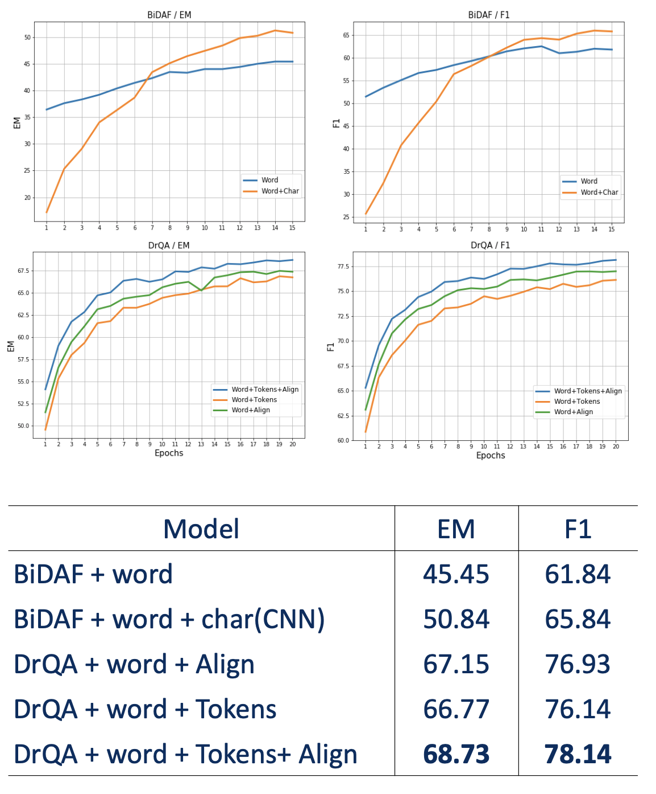

# EmbedQA
EmbedQA: Comparative Analysis of BiDAF and DrQA with Different Embedding Methods for Question Answering

This a coursework for 2019 umich EECS 595 Natural Language Processing.

This project aims to investigate the performance of BiDAF (Bi-Directional Attention Flow) and DrQA (Document Reader Question Answering) models when combined with different embedding methods for Question Answering tasks. The evaluation of the models is based on the [SQuAD 2.0 dataset](https://rajpurkar.github.io/SQuAD-explorer/explore/v2.0/dev/) provided by Stanford University.

## Framework of BiDAF and DrQA


## How to run?

Type this in the command line:

```shell
python main.py
```


## Evaluation


